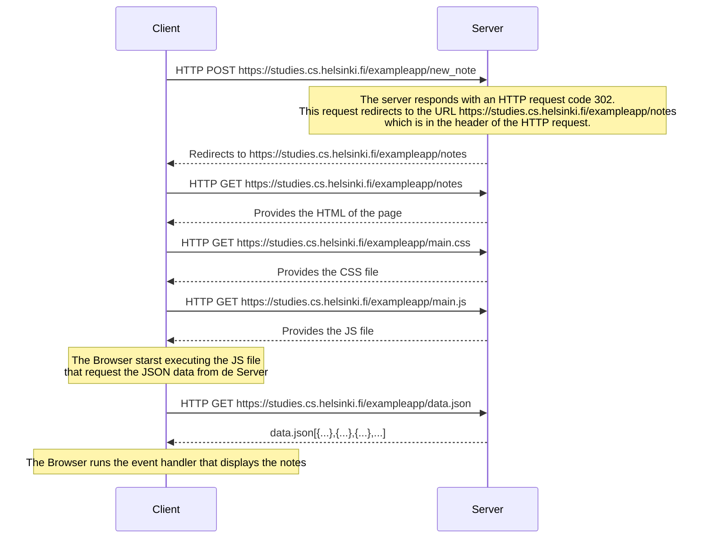

```mermaid
sequenceDiagram
    Client->>Server:HTTP POST https://studies.cs.helsinki.fi/exampleapp/new_note
    Note over Server:The server responds with an HTTP request code 302.<br /> This request redirects to the URL https://studies.cs.helsinki.fi/exampleapp/notes<br/>which is in the header of the HTTP request.
    Server-->>Client:Redirects to https://studies.cs.helsinki.fi/exampleapp/notes
    Client->>Server:HTTP GET https://studies.cs.helsinki.fi/exampleapp/notes
    Server-->>Client:Provides the HTML of the page
    Client->>Server:HTTP GET https://studies.cs.helsinki.fi/exampleapp/main.css
    Server-->>Client:Provides the CSS file
    Client->>Server:HTTP GET https://studies.cs.helsinki.fi/exampleapp/main.js
    Server-->>Client:Provides the JS file
    Note over Client: The Browser starst executing the JS file<br/>that request the JSON data from de Server
    Client->>Server:HTTP GET https://studies.cs.helsinki.fi/exampleapp/data.json
    Server-->>Client:data.json[{...},{...},{...},...]
    Note over Client:The Browser runs the event handler that displays the notes
```