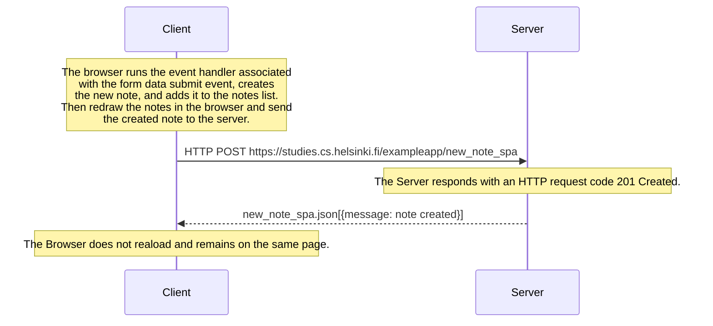

```mermaid
sequenceDiagram
    Note over Client: The browser runs the event handler associated<br/> with the form data submit event, creates<br/> the new note, and adds it to the notes list.<br/> Then redraw the notes in the browser and send<br/> the created note to the server.
    Client->>Server:HTTP POST https://studies.cs.helsinki.fi/exampleapp/new_note_spa
    Note over Server:The Server responds with an HTTP request code 201 Created.
    Server-->>Client:new_note_spa.json[{message: note created}]
    Note over Client: The Browser does not reaload and remains on the same page.
```